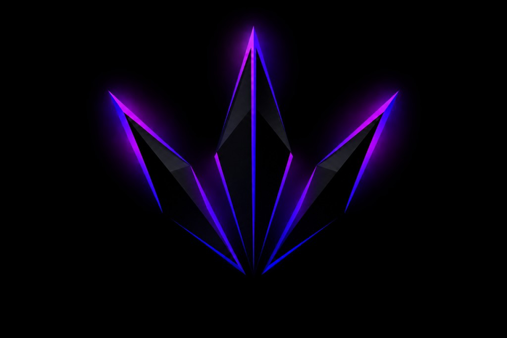

<div align="center">



# Black Tier Circle

### Production-Grade Multi-Tenant Telegram Commerce Platform  
### with Three-Layer Persistent AI Memory (MemoryOS)

[](https://blacktiercircle.vercel.app)
[](https://t.me/blacktiercirclebot)
[](https://nextjs.org)
[](https://www.typescriptlang.org)
[](https://supabase.com)
[](https://vercel.com)
[](#testing)
[](#security)

> **HackWithHyderabad 3.0** · A fully deployed, production-grade platform solving a real market crisis in India's $2B+ digital reseller economy.

**[Live Demo](https://blacktiercircle.vercel.app)** · **[Telegram Bot](https://t.me/blacktiercirclebot)** · **[Try the Demo](./DEMO.md)** · **[Architecture](./ARCHITECTURE.md)** · **[Innovation](./INNOVATION.md)**

</div>

---

## 🔓 Evaluation Access

The live platform is configured for open evaluation. Sign up at [blacktiercircle.vercel.app](https://blacktiercircle.vercel.app) with any email — you receive full platform admin access instantly, with no approval gate.

> This is intentional for evaluation. In production, new reseller accounts require owner approval before activation. A violet **Demo Mode** banner in the dashboard confirms evaluation access is active. All features — bots, orders, wallets, supplier API, AI intelligence, MemoryOS — are fully functional.

## Executive Summary

Black Tier Circle is a **production-deployed, multi-tenant Telegram commerce platform** that allows digital product resellers to launch a fully-featured Telegram shop in under 60 seconds — with zero coding, zero infrastructure management, and zero custody of customer funds by the platform.

The platform introduces **MemoryOS**: a novel three-layer persistent AI memory architecture (Platform → Tenant → Customer) powered by vector embeddings, giving every reseller an AI business assistant (RIA) with genuine long-term context — not generic chatbot responses.

**Status:** Fully deployed at [blacktiercircle.vercel.app](https://blacktiercircle.vercel.app) with live Telegram bot at [@blacktiercirclebot](https://t.me/blacktiercirclebot).

---

## The Problem We Solve

### India's Digital Reseller Crisis

India has an estimated **15–20 million active digital product sellers** operating through Telegram — selling OTT subscriptions, software licenses, gift cards, and digital credentials to millions of buyers daily. This is a largely undocumented but economically significant informal economy.

**The manual reality for every reseller:**

| Task | Manual Effort | With Black Tier Circle |
|------|--------------|----------------------|
| Set up a shop bot | 3–7 days (coding required) | 60 seconds (paste token) |
| Payment infrastructure | Custom build or trust a middleman | Built-in (4 payment methods) |
| Inventory management | Spreadsheets / manual tracking | Automated with supplier APIs |
| Order fulfillment | Manual delivery per order | Automated (2-min cron cycle) |
| Customer history | None | Full per-customer AI memory |
| Business intelligence | Zero visibility | RIA with persistent memory |

**The market catalyst:** In August 2026, Billgang and Antistock — the two dominant platforms serving this exact market — simultaneously executed exit scams. Thousands of active resellers lost their entire infrastructure overnight with no viable alternative. Black Tier Circle is that alternative: non-custodial, India-first, built for Telegram.

---

## What Makes This Different

### 1. True Multi-Tenancy with Bot Isolation
Each reseller operates their own independent Telegram bot. Webhooks are isolated per `bot_connection_id`. Row Level Security enforces zero data crossover between tenants at the database level. The platform owner never sees customer conversations.

### 2. MemoryOS — Three-Layer AI Memory
The AI assistant doesn't just answer questions — it *remembers*. Every interaction is stored in the appropriate memory bank via vector embeddings. A customer asking "what did I buy last month?" gets a real answer from their personal memory bank. A reseller asking "what are my best-selling products?" gets data synthesized from their store's memory history. See [INNOVATION.md](./INNOVATION.md) for full technical depth.

### 3. Non-Custodial Architecture
Black Tier Circle never holds reseller funds. Resellers pre-fund their own USDT wallet and transact independently. The platform takes a subscription fee, not a cut of every transaction — aligning incentives with reseller success.

### 4. Production-Grade from Day One
26+ database tables, 21 applied migrations, 171 passing tests, AES-256-GCM bot token encryption, automated cron jobs for fulfillment and reconciliation. This is not a demo — it's deployed infrastructure.

---

## Architecture Overview

See [ARCHITECTURE.md](./ARCHITECTURE.md) for the complete technical breakdown.

```
┌─────────────────────────────────────────────────────────────────────┐
│                        BLACK TIER CIRCLE                            │
│                                                                     │
│  ┌─────────────────┐  ┌──────────────────┐  ┌───────────────────┐  │
│  │  Platform Owner  │  │    Resellers     │  │    Customers      │  │
│  │  Dashboard       │  │    Dashboard     │  │  (Telegram Bot)   │  │
│  │  (Admin Panel)   │  │  (Tenant Panel)  │  │  @their_own_bot   │  │
│  └────────┬─────────┘  └────────┬─────────┘  └────────┬──────────┘  │
│           │                     │                     │             │
│  ┌────────▼─────────────────────▼─────────────────────▼──────────┐  │
│  │                   Next.js 14 API Layer                        │  │
│  │                                                               │  │
│  │  /api/webhooks/telegram/[botConnectionId]  ← per-bot         │  │
│  │  /api/assistant          ← RIA + MemoryOS                    │  │
│  │  /api/fulfillment/process ← cron: every 2 min                │  │
│  │  /api/supplier/reconcile  ← cron: every 15 min               │  │
│  │  /api/bots/health         ← cron: every 30 min               │  │
│  │  /api/supplier/sync       ← cron: every 30 min               │  │
│  └───────────────────────────────┬───────────────────────────────┘  │
│                                  │                                   │
│  ┌───────────────────────────────▼───────────────────────────────┐  │
│  │                Supabase (PostgreSQL)                          │  │
│  │  Row Level Security · Auth · Storage · Real-time              │  │
│  │  26+ tables · 21 migrations · bigint monetary precision       │  │
│  └──────────────┬─────────────────────────┬───────────────────────┘  │
│                 │                         │                          │
│  ┌──────────────▼──────┐   ┌─────────────▼────────┐                 │
│  │  Hindsight/Vectorize │   │   Supplier Adapters   │                 │
│  │  MemoryOS Banks      │   │   ProdSeller/Canboso  │                 │
│  │  Vector Embeddings   │   │   Auto-detect by key  │                 │
│  └─────────────────────┘   └──────────────────────┘                 │
└─────────────────────────────────────────────────────────────────────┘
```

---

## MemoryOS — The AI Intelligence Layer

> Full technical specification in [INNOVATION.md](./INNOVATION.md)

MemoryOS is a **three-layer persistent memory architecture** built on [Hindsight by Vectorize](https://vectorize.io) — a managed vector embedding service. It gives the RIA (Reseller Intelligence Assistant) genuine long-term memory across every session.

```
MEMORY LAYER HIERARCHY
━━━━━━━━━━━━━━━━━━━━━━━━━━━━━━━━━━━━━━━━━━━━━━━━━━
Layer 1 · Platform     btc-prod:platform
  └─ Global market intelligence, cross-tenant trends
  
Layer 2 · Tenant       btc-prod:tenant:{tenantId}
  └─ Store sales history, product performance, reseller strategy
  
Layer 3 · Customer     btc-prod:tenant:{tenantId}:customer:{customerId}
  └─ Individual purchase history, preferences, support context
━━━━━━━━━━━━━━━━━━━━━━━━━━━━━━━━━━━━━━━━━━━━━━━━━━
```

### Real Example

**Reseller asks RIA:** *"What cart recovery tactics work best for my store?"*

RIA performs a semantic search across the tenant's memory bank, retrieves the most relevant historical interactions and performance data, and responds with store-specific insights — not generic advice. The `→ Memory` badge in the UI shows when the response is grounded in stored context.

```typescript
// lib/hindsight.ts — Memory bank resolution
export function resolveCustomerMemoryBank(tenantId: string, customerId: string): string {
  return `${process.env.HINDSIGHT_BANK_PREFIX}:tenant:${tenantId}:customer:${customerId}`;
}

// Semantic recall — server-side only, bank ID never from browser
export async function recallCustomerExperience(bankId: string, query: string) {
  const hindsight = new HindsightClient({ apiKey: process.env.HINDSIGHT_API_KEY });
  return hindsight.recall({ bankId, query, topK: 5 });
}
```

---

## Feature Set

### Platform Owner
- ✅ Master product catalog with stock management
- ✅ Supplier integration — ProdSeller, Canboso, Generic adapters (auto-detected by key prefix)
- ✅ Reseller network management and invitation system
- ✅ Revenue analytics across all tenants
- ✅ Platform-wide bot health monitoring dashboard
- ✅ RIA with platform-level memory (cross-tenant intelligence)

### Reseller Dashboard
- ✅ Connect any Telegram bot in under 60 seconds (paste BotFather token → live)
- ✅ Custom pricing margin per product (buy at owner price, sell at own price)
- ✅ Store analytics, order history, customer management
- ✅ Wallet top-up token generation (12-digit codes for customer recharge)
- ✅ RIA chatbot with persistent store-level memory
- ✅ Multi-session chat history (localStorage with 10-session cap)
- ✅ Dark/light theme with 0.35s crossfade transition

### Customer Telegram Bot Experience
- ✅ Full command suite: `/start /menu /shop /wallet /deposit /orders /profile /support /refer /find /terms /api`
- ✅ 9 main menu buttons with inline keyboard navigation
- ✅ Quantity selector (1 to min(stock, 10)) before payment
- ✅ 4 payment methods: Wallet balance · Binance Pay · USDT BEP20 · USDT TRC20
- ✅ Instant automated delivery for supplier API products post-payment
- ✅ Full order history and real-time status in-bot
- ✅ Referral system with tracking

### Automated Infrastructure
- ✅ Fulfillment processor: every 2 minutes
- ✅ Supplier reconciliation: every 15 minutes
- ✅ Bot health monitoring: every 30 minutes
- ✅ Supplier catalog sync: every 30 minutes
- ✅ Smart caching — products (60s), customer data (30s), bot context (120s)

---

## Tech Stack

| Layer | Technology | Decision Rationale |
|-------|-----------|-------------------|
| Framework | Next.js 14.2 + TypeScript (strict) | App Router, API routes, Vercel-native |
| Database | Supabase PostgreSQL | Row Level Security, auth, real-time subscriptions |
| Bot Framework | grammY | Modern, TypeScript-first Telegram framework |
| AI Memory | Hindsight by Vectorize | Managed vector embeddings, persistent memory banks |
| AI Inference | Groq API (`openai/gpt-oss-20b`) | Fast inference, low latency for chat responses |
| Payments | Binance Pay + USDT BEP20/TRC20 | Crypto-native, no Indian banking friction |
| UI Components | Tailwind CSS + shadcn/ui | Rapid, accessible, consistent |
| Animation | Framer Motion + GSAP + ScrollTrigger + Lenis | Fluid page transitions, smooth scroll |
| 3D / WebGL | Three.js + custom GLSL shaders | React 18 compatible (avoided R3F/React 19 conflict) |
| Deployment | Vercel | Edge network, automatic preview deploys |
| Cron | cron-job.org | External cron, survives Vercel function timeouts |

---

## Database Schema

**26+ tables across 21 applied migrations. All monetary values as bigint minor units (1 USDT = 1,000,000) — no floating point errors.**

```
CORE IDENTITY
  profiles              User accounts (Supabase Auth)
  tenants               Reseller organizations
  invitations           Reseller onboarding tokens
  api_keys              External API access

BOT INFRASTRUCTURE  
  bot_connections       Telegram bot registrations (token AES-256-GCM encrypted)
  processed_telegram_updates  Idempotency table (prevents double-processing)
  webhook_endpoints     Registered webhook URLs

COMMERCE
  products              Master product catalog (owner-managed)
  product_assets        Digital delivery files / credentials
  reseller_listings     Per-tenant product pricing and margin
  suppliers             External supplier accounts
  supplier_products     Supplier catalog cache

CUSTOMERS & ORDERS
  customers             Per-tenant customer records
  orders                Order lifecycle management
  order_events          Immutable order audit trail
  delivery_attempts     Fulfillment attempt log
  fulfillment_attempts  Retry tracking with backoff

PAYMENTS
  wallets               Customer USDT balance accounts
  ledger_transactions   Double-entry accounting ledger
  topup_tokens          12-digit wallet recharge codes
  payment_claims        Pending payment verifications
  wallet_reservations   Fund holds during checkout

PLATFORM
  platform_settings     Global configuration
  tenant_settings       Per-reseller configuration
  notifications         In-app notification queue
  audit_log             Complete action audit trail
```

---

## Security

Every layer is secured by design, not by convention.

| Threat | Mitigation |
|--------|-----------|
| Bot token exposure | AES-256-GCM encryption at rest; decrypted only at request time |
| Cross-tenant data access | PostgreSQL Row Level Security on all tables |
| Secret exposure to browser | Zero `NEXT_PUBLIC_` prefix on any sensitive key |
| Memory bank manipulation | Bank IDs resolved server-side from authenticated session only |
| Unauthorized cron execution | `CRON_SECRET` header validation on all cron endpoints |
| Replay attacks on webhooks | `processed_telegram_updates` idempotency table |
| Key exposure in version control | `.env.local` gitignored; verified via `git log --all -- .env.local` |
| API key leakage in code | All keys via `process.env.*` — confirmed via `git grep "gsk_" HEAD` |

---

## Project Structure

```
Black-Tier-Circle/
├── app/
│   ├── api/
│   │   ├── assistant/            # RIA chatbot endpoint + MemoryOS integration
│   │   ├── webhooks/
│   │   │   └── telegram/[id]/    # Per-bot isolated webhook handler
│   │   ├── fulfillment/
│   │   │   └── process/          # Order fulfillment cron (2-min cycle)
│   │   ├── supplier/
│   │   │   ├── reconcile/        # Supplier reconciliation (15-min cycle)
│   │   │   └── sync/             # Catalog sync (30-min cycle)
│   │   ├── intelligence/
│   │   │   ├── customer/         # Customer memory read/write
│   │   │   └── store/            # Store memory read/write
│   │   └── bots/
│   │       └── health/           # Bot health check cron (30-min cycle)
│   ├── dashboard/                # Platform owner pages
│   ├── reseller/                 # Reseller tenant pages
│   └── (landing)/                # Public marketing landing page
├── components/
│   ├── assistant/
│   │   ├── assistant-page.tsx    # Multi-session chat with localStorage persistence
│   │   ├── assistant-chat.tsx    # Chat message rendering + Memory badge
│   │   └── assistant-chat-input.tsx
│   ├── intelligence/             # MemoryOS UI components
│   └── ui/                       # shadcn/ui component library
├── lib/
│   ├── hindsight.ts              # MemoryOS client + three-layer bank resolution
│   ├── telegram/                 # grammY bot handlers (all 9 menu flows)
│   └── supabase/                 # Database client, server client, types
├── scripts/
│   ├── seed-memory-demo.ts       # Seeds all three memory layers with demo data
│   ├── seed-platform-bank.ts     # Platform-level memory seeder
│   └── test-memory-isolation.ts  # Verifies tenant memory isolation
└── supabase/
    └── migrations/               # 0001–0021 (all applied)
```

---

## Local Development

```bash
# 1. Clone
git clone https://github.com/Luvoia-Web/Black-Tier-Circle.git
cd Black-Tier-Circle

# 2. Install (legacy-peer-deps required for grammY + shadcn compatibility)
npm install

# 3. Configure environment
cp .env.example .env.local
# Fill in credentials (see Environment Variables below)

# 4. Apply database migrations
# Run migrations/0001 through migrations/0021 in Supabase SQL Editor in order

# 5. Seed MemoryOS demo data
npm run memory:seed

# 6. Verify memory isolation
npm run memory:smoke

# 7. Start development server
npm run dev
```

### Environment Variables

```env
# ── Supabase ─────────────────────────────────────────────────
NEXT_PUBLIC_SUPABASE_URL=https://your-project.supabase.co
NEXT_PUBLIC_SUPABASE_ANON_KEY=eyJ...
SUPABASE_SERVICE_ROLE_KEY=eyJ...          # Server-side only

# ── Security ──────────────────────────────────────────────────
BOT_TOKEN_ENCRYPTION_KEY=                  # 32-byte hex — AES-256-GCM
CRON_SECRET=                               # Cron endpoint auth header

# ── App ───────────────────────────────────────────────────────
NEXT_PUBLIC_APP_URL=https://blacktiercircle.vercel.app

# ── AI / MemoryOS ─────────────────────────────────────────────
# IMPORTANT: NO NEXT_PUBLIC_ prefix — server-side only
GROQ_API_KEY=gsk_...                       # Groq inference API
HINDSIGHT_API_KEY=hsk_...                  # Hindsight vector memory
HINDSIGHT_API_URL=https://...
HINDSIGHT_ENABLED=true
HINDSIGHT_BANK_PREFIX=btc-prod             # Namespace for memory banks
```

---

## Live Demo

| Resource | Link |
|---------|------|
| Platform Dashboard | [blacktiercircle.vercel.app](https://blacktiercircle.vercel.app) |
| Telegram Bot | [@blacktiercirclebot](https://t.me/blacktiercirclebot) |
| GitHub Repository | [Luvoia-Web/Black-Tier-Circle](https://github.com/Luvoia-Web/Black-Tier-Circle) |

**To test the bot:** Open Telegram → search `@blacktiercirclebot` → send `/start`

> **Demo Mode Active:** Sign up with any email to get instant full admin access. The platform runs with `NEXT_PUBLIC_DEMO_MODE=true` for evaluation — no approval workflow, no restrictions.

---

## Market Context

| Metric | Data |
|--------|------|
| Digital product sellers on Telegram (India est.) | 15–20 million |
| Market catalyst | Billgang + Antistock exit scams (August 2026) |
| Platform model | ₹2,000/month subscription per reseller |
| Revenue model | Subscription + optional transaction fee |
| Competitive positioning | Non-custodial · India-first · Instant setup |
| Primary currency | USDT (crypto-native, bypasses INR friction) |

---

## Built By

**Kushal Chaudhari** — Solo founder, BTech CSE (AI/ML), Nashik, India  
Building AI-native infrastructure for India's informal digital economy.

[](https://linkedin.com/in/kush0090)

---

<div align="center">

**[ARCHITECTURE.md](./ARCHITECTURE.md)** · **[INNOVATION.md](./INNOVATION.md)**

*Black Tier Circle — Every reseller deserves enterprise-grade infrastructure.*

</div>
